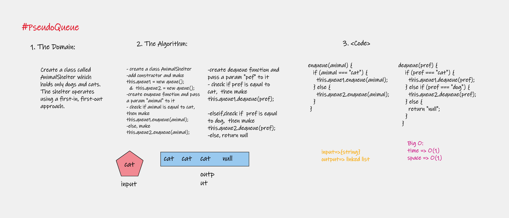

# socket-io-refactor
In this phase, we’ll be moving away from using Node Events for managing a pool of events, instead refactoring to using the Socket.io libraries. This allows communication between Server and Client applications.  The intent here is to build the data services that would drive a suite of applications where we can see pickups and deliveries in real-time.

## UML diagram

## **here are the links for the server:**

**1. The Actions link:**
   [Actions](https://github.com/marah-jaradat/bearer-auth/actions)

**2. The Pull request:**
   [pull request](https://github.com/marah-jaradat/bearer-auth/pull/6)

**3. Heroku link**
    [deploy-main](https://bearer-7.herokuapp.com/)
